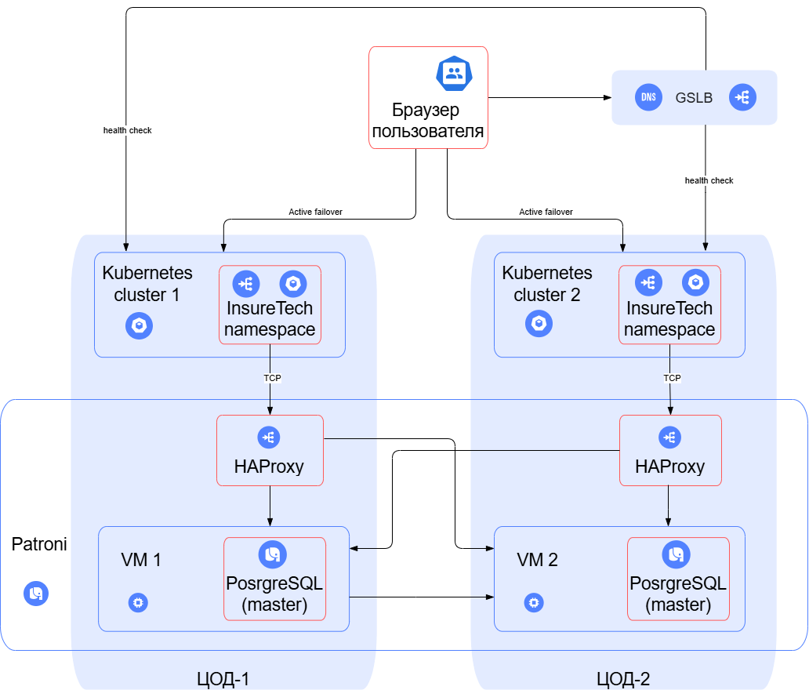

## Teхнологическая архитектура TO BE

Failover стратегия - active-active с георезирвированием.
+Высокий уровень отказоустойчивости, равномерное распределение нагрузки, быстрая загрузка страниц, Rate limiting

Использование нескольких независимых кластеров, которые разворачиваются в границах разных ЦОД. В каждом из этих кластеров развёрнут независимый экземпляр приложения с аналогичными конфигурациями. При этом понадобится отдельный компонент для балансировки трафика между ними.
Этот подход снижает зависимость от сетевой связанности между ЦОД и от внутренних недостатков фейловер-механизмов в Kubernetes

Использование Patroni, который позволяет добиться высокой доступности и отказоустойчивости распределённого кластера PostgreSQL

Шардирование не требуется (размер БД всего 50 ГБ). НО стоит сделать разделение на различные БД существующих схем.

## Teхнологическая архитектура представлена на схеме.

