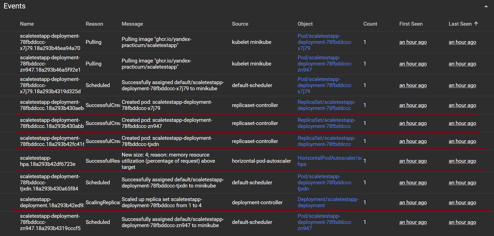
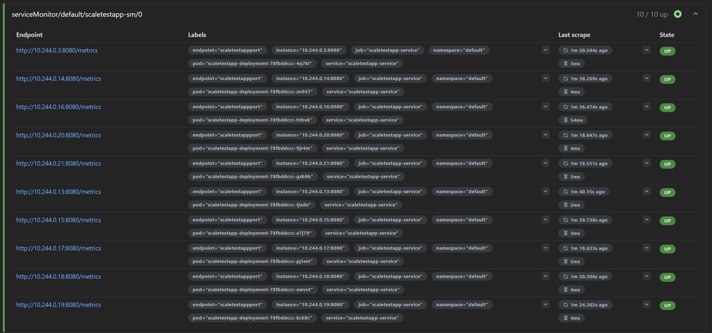
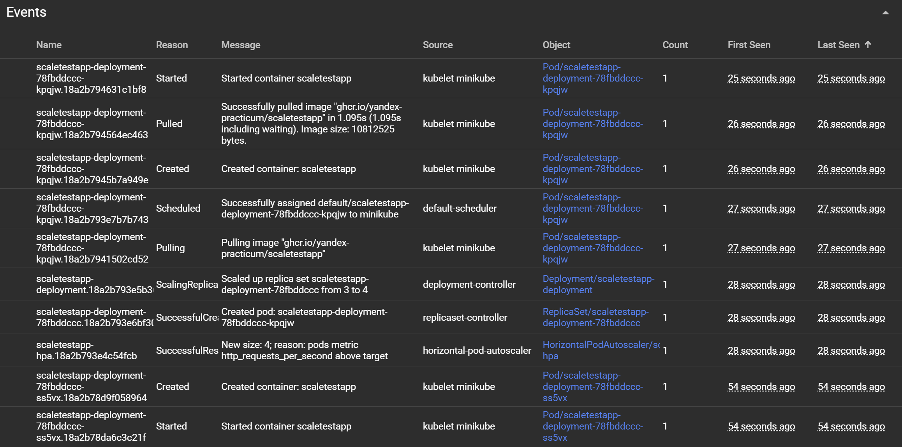
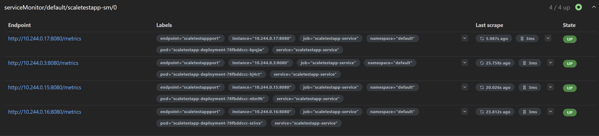

# Динамическое масштабирование контейнеров

## Динамическая маршрутизация на основании показателей утилизации памяти

### События по увеличению кол-ва реплик

### Рабочие поды

## Динамическая маршрутизация на основании показателей количества запросов в секунду

### События по увеличению кол-ва реплик

### Рабочие поды

