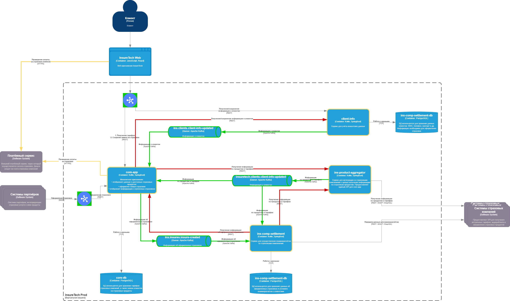

## Устранение проблем, связанных с ростом нагрузки:
### Для устранения проблем, связанных с ростом нагрузки, необходимо:
#### 1) Перейти на Event-Driven архитектуру, для этого применить паттерн "Репликация данных" и перейти на асинхронную интеграцию посредством Kafka.
#### 2) Релизовать паттер "Rate Limiting" для пользователей и для взаимодействия с партнерами.

#### Так же необходимо перейти на защищенные каналы взаимодействия с внешними системами.

## Необходимые изменения представлены на схеме АДР.

